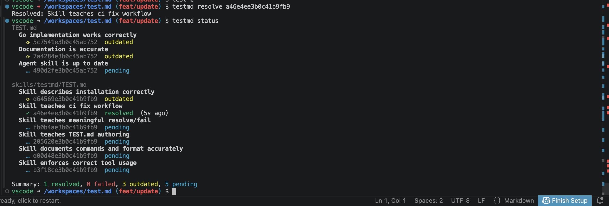

# TEST.md

Executable contracts for your codebase: "if you changed X, verify Y".



## The problem

You changed the API schema. CI is green — unit tests pass. You merged. A week later someone discovers the docs are stale — they still describe the old fields.

This isn't a bug in the code. It's knowledge that lived in one person's head and was never written down. Unit tests check code, linters check style — but nothing checks that changing a schema means updating the docs.

## The solution

testmd is contracts written in natural language. Each contract is bound to files. When those files change, the contract requires re-verification.

````markdown
# Documentation matches API

```yaml
watch:
  - ./api/schema/**
  - ./docs/api.md
```

1. Open docs/api.md
2. Compare documented endpoints with the schema in api/schema/
3. Verify all fields, types, and examples are up to date
````

```
$ testmd status
TEST.md
  Documentation matches API
    … f3a1b2e3b0c45ab752  pending

$ testmd resolve f3a1b2
Resolved: Documentation matches API

# ... time passes, someone changes api/schema/users.yaml ...

$ testmd status
TEST.md
  Documentation matches API
    ⟳ f3a1b2e3b0c45ab752  outdated

# The contract needs re-verification.
# Check the docs, update them, resolve:

$ testmd resolve f3a1b2
Resolved: Documentation matches API

$ testmd ci
OK: all tests resolved
```

## Automatic contracts from filesystem

Contracts can be created automatically. Add a new service — the healthcheck contract appears on its own:

````markdown
# {service} healthcheck

```yaml
each:
  service: ./services/*/
watch: ./services/{service}/**
```

Verify `{service}` responds to GET /health with 200.
````

```
$ testmd status
TEST.md
  {service} healthcheck
    ✓ ed4be2fe0c315ab752  service=auth     resolved
    ✓ ed4be2c9054d5ab752  service=billing  resolved
    … ed4be2ab12345ab752  service=payments pending     # new!
```

`each` supports filesystem glob patterns and explicit lists. Multiple variables produce a cartesian product. For irregular sets, use `combinations`.

## When to use

**Use testmd** when a check is needed regularly but can't be fully automated (or can't be automated yet):
- API schema changed — is the documentation up to date?
- DB schema changed — do the migrations work?
- Config changed — are the deploy scripts correct?
- Added a service — is monitoring set up?

**Don't use testmd** if the check can be fully automated — write a unit test or a lint rule. testmd is for what lives between automated tests and human knowledge.

## CI

`testmd ci` returns exit code 1 if any contracts are unresolved:

```yaml
# GitHub Actions
- name: Install testmd
  run: curl -fsSL https://raw.githubusercontent.com/exa-pub/test.md/main/install.sh | sh

- name: Check contracts
  run: testmd ci --report-md test-report.md

- name: Upload report
  if: always()
  uses: actions/upload-artifact@v4
  with:
    name: testmd-report
    path: test-report.md
```

```yaml
# GitLab CI
testmd:
  image: ghcr.io/exa-pub/test.md:latest-alpine
  stage: test
  script:
    - testmd ci --report-md report.md --report-json report.json
  artifacts:
    when: always
    paths:
      - report.md
      - report.json
```

For other CI systems, `curl | sh` + `testmd ci` is all you need.

## AI agents

testmd is especially useful when AI agents write code. An agent doesn't know your project's unwritten rules — but it can read the contracts:

```bash
testmd status           # what became outdated after my changes?
testmd get abc123       # what exactly should I verify?
# ... checks, fixes ...
testmd resolve abc123   # verified
testmd ci               # all good?
```

### Agent Skill for Claude Code

testmd ships with an [Agent Skill](https://support.claude.com/en/articles/12512176-what-are-skills) that teaches Claude Code the contract workflow — when to run `status`, how to use `get` instead of reading raw markdown, and how to properly resolve and fail tests.

```
/plugin marketplace add exa-pub/test.md
/plugin install testmd@testmd
```

Or install directly:
```
/plugin install-from-github exa-pub/test.md/skills/testmd
```

## Install

```bash
curl -fsSL https://raw.githubusercontent.com/exa-pub/test.md/main/install.sh | sh
```

Or with Go:
```bash
go install github.com/testmd/testmd/cmd/testmd@latest
```

Initialize a project:
```bash
testmd init  # creates .testmd.yaml
```

## Commands

```bash
testmd init                                        # create .testmd.yaml
testmd status [--report-md F] [--report-json F]    # show all contract statuses
testmd get <id>                                    # show contract details
testmd resolve <id>                                # mark as verified
testmd fail <id> "reason"                          # mark as failed
testmd reset <id>                                  # reset to pending
testmd gc                                          # remove orphaned records
testmd ci [--report-md F] [--report-json F]        # CI gate: exit 1 if not all resolved
```

## Documentation

- [Specification](docs/specification.md) — full format and behavior reference
- [CLI Reference](docs/cli.md) — all commands and options
- [Architecture](docs/architecture.md) — internal design and data flow
- [Examples](docs/examples.md) — variables, matrices, and other patterns
